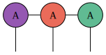
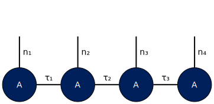
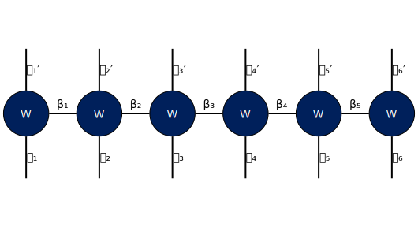
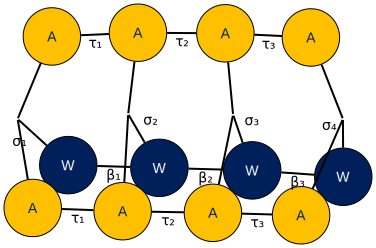

# tn-diagram
Tensor Network diagram repository

- [Sample](graphviz/sample.dot)
  

- [Matrix](graphviz/matrix.dot)
  

- [SVG](graphviz/svg.dot)
  

- [MPS](graphviz/mps.dot)
  

- [MPO](graphviz/mpo.dot)
  

- [Diagonal MPO](graphviz/g-mpo.dot)
  
