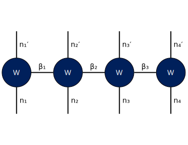

# tn-diagram
Tensor Network diagram repository

- [Sample](graphviz/sample.dot)
  
  

- [Matrix](graphviz/matrix.dot)
  
  

- [SVD](graphviz/svd.dot)
  
  

- [MPS](graphviz/mps.dot)
  
  
  
  

- [MPO](graphviz/mpo.dot)
  
  
  

- [Contraction](graphviz/g-mpo.dot)
  
  
  
